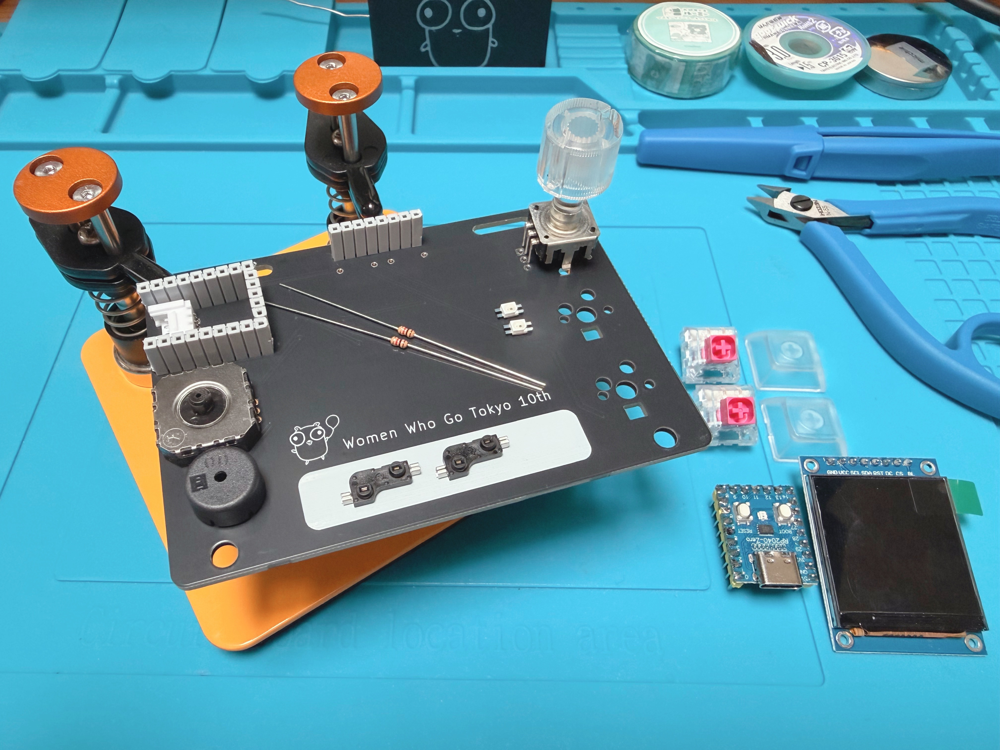

# 2026-anniversary-badge ビルドガイド

このドキュメントは Women Who Go Tokyo 10 周年記念バッジ (`wwgt2026badge`) の組み立て手順をまとめたものです。はんだ付けに少し慣れている方なら 1 〜 2 時間程度で完成します。

## パーツ一覧



| No | 品名                                                                                                                                                 | 個数 | 備考                   |
| -- |----------------------------------------------------------------------------------------------------------------------------------------------------| ---- |----------------------|
| 1  | 基板                                                                                                                                                 | 1 |                      |
| 2  | [RP2040 Zero](https://ja.aliexpress.com/item/1005008186242400.html)                                                                                | 1 | Waveshare RP2040-Zero |
| 3  | [ジョイスティック](https://akizukidenshi.com/catalog/g/g104048/)                                                                                           | 1 | アナログ 2 軸             |
| 4  | [ST7789 液晶](https://ja.aliexpress.com/item/1005009249695645.html)                                                                                  | 1 | 240 × 240            |
| 5  | [プルアップ抵抗](https://akizukidenshi.com/catalog/g/g116332/)                                                                                            | 2 | 470Ω 〜 1kΩ           |
| 6  | [キースイッチ](https://shop.yushakobo.jp/collections/all-switches)                                                                                       | 2 | MX 互換                |
| 7  | [キーキャップ](https://shop.yushakobo.jp/collections/keycaps?sort_by=created-descending&filter.v.availability=1&filter.v.price.gte=&filter.v.price.lte=) | 2 |                      |
| 8  | [キーソケット](https://shop.yushakobo.jp/products/a01ps?variant=37665172521121)                                                                          | 2 | MX socket            |
| 9  | [LED 付きロータリーエンコーダー](https://akizukidenshi.com/catalog/g/g105771/)                                                                                  | 1 | EC11 互換              |
| 10 | [RGB LED](https://akizukidenshi.com/catalog/g/g115478/)                                                                                            | 2 | SK6812MINI-E         |
| 11 | [ブザー](https://akizukidenshi.com/catalog/g/g104118/)                                                                                                | 1 |                      |
| 12 | [Grove 端子](https://akizukidenshi.com/catalog/g/g112634/)                                                                                           | 1 |                      |
| 13 | [ピンソケット 9Pin](https://akizukidenshi.com/catalog/g/g110100/)                                                                                        | 2 | RP2040 Zero 用        |
| 14 | [ピンソケット 5Pin](https://akizukidenshi.com/catalog/g/g102762/)                                                                                        | 1 | RP2040 Zero 用        |
| 15 | [ピンソケット 8Pin](https://akizukidenshi.com/catalog/g/g103785/)                                                                                                                                    | 1 | ST7789 液晶用           |
| 16 | ハット                                                                                                                                                | 1 | ジョイスティック用            |
| 17 | スイッチプレート                                                                                                                                           | 1 |                      |
| 18 | ボトムプレート                                                                                                                                            | 1 |                      |
| 19 | 木ねじ                                                                                                                                                | 2 | 2.1 × 10             |

## 必要な工具

- はんだごて (温度調整付きが望ましい)
- はんだ (鉛入りまたは鉛フリー)
- ピンセット
- ニッパー (抵抗などリード部品の足をカットする用)
- マスキングテープ (仮固定用)
- プラスドライバー (プレートを木ねじで固定するため)
- テスター (動作確認用、無くても可)

## 組み立ての全体像

おおまかな流れは次の通りです。

1. 表面実装部品をはんだ付けする (背の低いものから順に)
2. スルーホール部品をはんだ付けする
3. RP2040 Zero / ST7789 / ジョイスティックを実装する
4. ファームウェアを書き込んで動作確認する
5. プレート / キーキャップ / エンコーダーノブ / ハットを取り付けて完成

「先にはんだ付けが終わった部品が後から取り付ける部品の邪魔にならない」順番を意識すると安全です。

---

## Step 0. 作業準備

作業台を用意します。
作業台がない場合は、何らかの台などで基板を固定してください。

{画像}

名前を書くスペース (中央下段の四角い白塗り部分) がある側が `表`、QR コードが書いてある側が `裏` です。

##  Step 1. 抵抗のはんだ付け

極性はありません。表面から刺してください。  
向きが気になる場合はうまく調整してください。

裏返して裏面からはんだ付けしていきます。  
最初に片方の抵抗の片方のピンだけはんだ付けしてください。その後、位置を十分に確認して、気になるところがあれば、熱を加えながら修正してください。  
修正がよくわからない場合はサポートスタッフを呼んでください。

はんだ付けが完了したら足を短く (1 mm 以内) にカットします。  
カットするときはゴミが飛び散らないように指で押さえて実施してください。


##  Step 2. RGB LED のはんだ付け

RGB LEDE はパッケージの **角の切り欠き (マーク)** が 1 番ピン側 (DIN 側) です。基板のシルクの角に切り欠きを合わせて置いてください。

1 ピンだけ予備はんだしておき、ピンセットで部品を載せてからこてをあてて固定します。  
位置や向きを確認し、ずれている場合ははんだを溶かして整えます。

残り 3 ピンをはんだ付けします。  
2 個とも同じ向きで実装してください。

熱に弱い部品なので、こてを長時間あて続けないように注意してください。


##  Step 3. キーソケットのはんだ付け

シルクに合わせて MX 互換のキーソケットを基板の裏面 2 か所に置きます。

> **⚠ 向きに注意**  
> MX socket は逆向きにも刺さってしまいます。写真の向きと一致しているか必ず確認してください。

最初に片側のピンだけはんだ付けします。  
端子が太いので、ランド (基板側) をしっかり温めてからはんだを流します。  
はんだが溶けている間に、指でソケットを基板側に押し付けて密着させてください。  
位置や向きを確認し、必要があればはんだを溶かして整えます。

反対側のピンをはんだ付けして完了です。  
2 個目のソケットも同じ要領で取り付けます。


##  Step 4. Grove 端子のはんだ付け

Grove コネクターを基板の表面に差し込みます。  
差し込んだあとは裏返してはんだづけをするため、マスキングテープで固定しましょう。

まず 1 ピンだけはんだ付けします。  
位置 / 向きを確認し、必要があればはんだを溶かして整えます。

次に対角の 1 ピンをはんだ付けします (これで 2 ピン留まっている状態)。  
本体が浮いていないか、傾いていないかをもう一度確認します。

残りのピンをはんだ付けして完了です。


##  Step 5. ピンソケットのはんだ付け

基板の表面に、次のピンソケットを取り付けます。

- **9Pin × 2 + 5Pin × 1** : RP2040 Zero 用
- **8Pin × 1** : ST7789 液晶用

ピンソケットが浮いたり傾いたりすると、後で部品が斜めに刺さってしまいます。垂直に保つ工夫が必要です。

おすすめは、対応するピンヘッダー (RP2040 Zero や ST7789 液晶側の足) を一度ピンソケットに差し込んで、治具として使う方法です。これによりピンソケットがまっすぐ立ちます。

まず両端のピンだけはんだ付けします。  
基板を裏返して横から見て、ピンソケットが基板に密着していて垂直になっていることを確認してください。  
垂直になっていない場合は、もう一度はんだを溶かして整えます。

垂直が確認できたら、残りのピンをはんだ付けして完了です。


##  Step 6. ロータリーエンコーダーのはんだ付け

LED 付きロータリーエンコーダーを基板の表面に差し込みます。

本体が基板にしっかり密着していることを確認してください。  
基板を裏返して、はんだ付けをします。


##  Step 7. ブザーのはんだ付け

スルーホールタイプのブザーを基板の表面に差し込みます。  
極性はありません。

片足を仮はんだします。  
基板から浮かないように本体を密着させ、必要があればはんだを溶かして整えます。

反対側もはんだ付けして完了です。


##  Step 8. マイコン (RP2040 Zero) の取り付け

RP2040 Zero に付属のピンヘッダーを使い、Step 5 で取り付けたピンソケットを治具にしてマイコンに垂直にはんだ付けしていきます。

まずはピンヘッダーを基板のピンソケットに差し込みます。  
**この時点では、ピンヘッダーは基板にもマイコンにもはんだ付けしません**。  
ピンソケットを治具として使い、ピンヘッダーの垂直を出すための仮置きです。

そのうえにマイコンを写真の向きで載せます。  
**USB-C コネクタおよび白い BOOT ボタンが上を向く側が表面** です。

表面から 1 ピンだけはんだ付けします。  
位置や傾きを確認し、マイコンが垂直に立っていない場合はもう一度はんだを溶かして整えます。

垂直が確認できたら、残りのピンを表面からはんだ付けします。  


##  Step 9. ST7789 液晶の取り付け

ST7789 液晶モジュールを Step 5 で取り付けた **8Pin ピンソケット** に差し込みます。はんだ付けは不要です。

液晶モジュールに付属のピンヘッダーがそのまま 8Pin ピンソケットに刺さります。  
**表示面が前 (バッジの正面) を向くように** 向きを確認してください。  
液晶のフレキシブルケーブルや表示面に指で力をかけないよう注意してください。

差し込んだら、液晶が傾かずに基板と平行になっているかを横から確認します。


##  Step 10. ジョイスティックの取り付け

ジョイスティックモジュールを基板の表面に差し込みます。  
スティック側を上にして、基板のシルクで GND / VCC / VRX / VRY / SW の順序を確認してから差し込みます。

裏返して、まず 1 ピンだけはんだ付けします。  
本体が浮いていないか、傾いていないかを表面側から確認し、必要があればはんだを溶かして整えます。

残りのピンと、固定用の金具ピン (ある場合) もはんだ付けして完了です。

ここでハードウェアの基本実装は完了です。  
プレートを取り付ける前に、必ず Step 11 の動作確認を実施してください。

---

## Step 11. 動作確認 (ファームウェア書き込み)

> **📅 2026 年 5 月 30 日のワークショップ参加者の方へ**  
> 当日お渡しする RP2040 Zero には、あらかじめ動作確認用のファームウェアが書き込まれた状態でお渡しします。  
> このため、ワークショップ当日は以下のファームウェア書き込み手順をスキップして、そのまま動作確認に進んでいただけます。  
> 自宅でファームウェアを書き換える場合や、書き込み済みのファームウェアを上書きしたい場合に、以下の手順を参照してください。

プレートを付ける前に、必ず一度動作確認をしてください。

```
$ git clone https://github.com/WomenWhoGoTokyo/2026-anniversary-badge
$ cd 2026-anniversary-badge
$ tinygo flash --target waveshare-rp2040-zero --size short ./src/all.go
```

書き込み後の確認ポイントは次の通りです。`./src/all.go` の挙動に基づいています。

| 確認項目 | 期待する動作 |
| -------- | ------------ |
| ST7789 液晶 | 起動直後にロゴ画像が表示される |
| エンコーダー LED | 1 秒間隔で点滅し続ける |
| 上キーを押す | RGB LED 2 個が桜色 (ピンク) に光る。離すと消灯する |
| 下キーを押す | RGB LED 2 個が水色に光る。離すと消灯する |
| 上下キーを同時に押す | RGB LED が桜色と水色を混ぜた中間色に光る |
| ジョイスティックを倒す | 倒した方向に応じて RGB LED が 7 色の虹色 (淡い赤 / 橙 / 黄 / 緑 / 水色 / 青 / 紫) のいずれかに変わる |
| エンコーダーを回す | 液晶のロゴが 1 クリックあたり 15 度ずつ回転する |
| エンコーダーを押し込む | ブザーの ON / OFF がトグルされる。ON のあいだはドレミファソラシドが繰り返し鳴り続ける |

シリアルモニター (`tinygo monitor`) を併用すると、内部状態も確認できます。

| 操作 | シリアル出力例 |
| ---- | -------------- |
| 起動時 | `joystick: 8000 8000 (init)` |
| 上キー押下 | `The top button was pressed` |
| 下キー押下 | `The bottom button was pressed` |
| エンコーダー回転 | `rotary: 1 angle: 15` |
| エンコーダー押下 | `buzzer ON` / `buzzer OFF` (押すたびに切り替わる) |
| ジョイスティックを大きく倒す | `joystick: 6E10 7E30` のような XY 値 |

うまく動かない場合は、後述の「トラブルシュート」を参照してください。

---

## Step 12. ハードウェアの組み立て

動作確認が済んだら、ケース組み立てに進みます。

1. **スイッチプレートをはめる**  
    キースイッチを差し込む前に、スイッチプレートを基板の上にセットします。プレートの向きを基板のシルクや穴の位置で確認してください。
2. **キースイッチを差し込む**  
    プレート越しにキースイッチを基板の MX ソケットに押し込みます。ピンが曲がっていないか確認してから挿してください。
3. **キーキャップをはめる**  
    キーキャップをスイッチに被せます。
4. **エンコーダーノブをはめる**  
    ロータリーエンコーダーに付属のノブを、押し込みます。
5. **ジョイスティックハットをはめる**  
    ジョイスティックのスティック頭にハットを被せます。
6. **ボトムプレートを取り付ける**  
    基板の裏側にボトムプレートを当て、付属の **木ねじ 2.1 × 10** 2 本で固定します。木ねじはプラスドライバーでゆっくり締めてください。締めすぎるとプレートが割れたり基板が反ったりするので注意してください。

これで完成です。

---

## 付録 : 画像データの差し替え

液晶に表示するロゴ画像を変えたい場合は、`tools/imgconv` を使って PNG を RGB565 に変換します。

```
$ go run ./tools/imgconv -in src/images/badge240.png -out src/images/badge.rgb565
```

`src/images/badge240.png` を 240 × 240 の好みの画像に差し替えてからコマンドを実行し、その後 `tinygo flash` で書き直してください。
